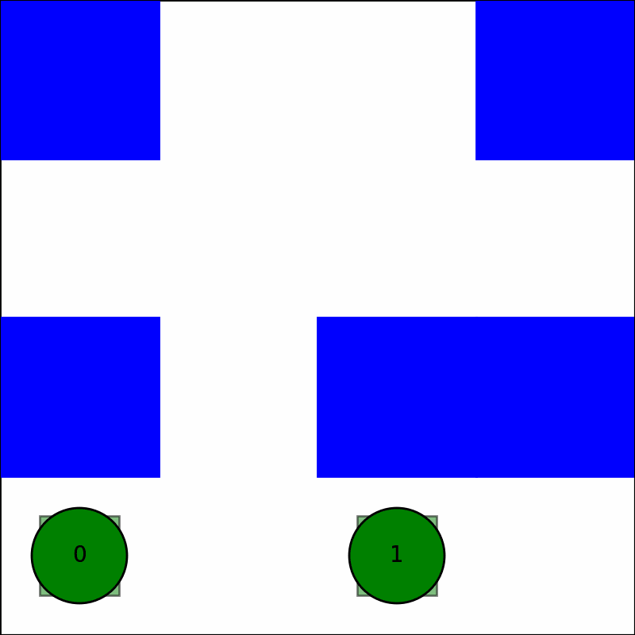
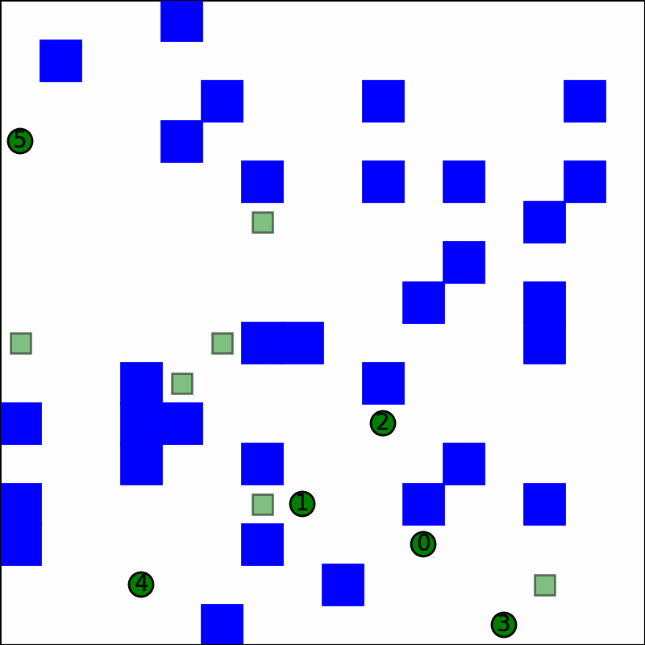
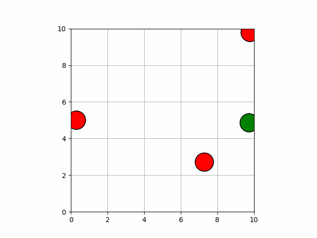

# Multi-Agent path planning in Python

## Introduction

This repository consists of the implementation of some multi-agent path-planning algorithms in Python. 
The following algorithms are currently implemented:

- [Multi-Agent path planning in Python](#multi-agent-path-planning-in-python)
  - [Introduction](#introduction)
  - [Dependencies](#dependencies)
  - [Centralized Solutions](#centralized-solutions)
    - [Prioritized Safe-Interval Path Planning](#prioritized-safe-interval-path-planning)
      - [Execution](#execution)
      - [Results](#results)
      - [Reference](#reference)
    - [Conflict Based Search](#conflict-based-search)
      - [Execution](#execution-1)
      - [Results](#results-1)
      - [Reference](#reference-1)
    - [Post-Processing](#post-processing)
      - [Post-processing with TPG](#post-processing-with-tpg)
  - [Decentralized solutions](#decentralized-solutions)
    - [Velocity obstacles](#velocity-obstacles)
      - [Execution](#execution-2)
      - [Results](#results-2)
      - [References](#references)

## Dependencies

Install the necessary dependencies by running.

```shell
numpy:         pip install numpy
matplotlib:    pip install matplotlib
scipy:         pip install scipy
ffmpeg-python: pip install ffmpeg-python
```

## Centralized Solutions

It is the responsibility of the central planner to provide a plan to the robots.

### Prioritized Safe-Interval Path Planning

SIPP is a local planner, using which, a collision-free plan can be generated, after considering the static and dynamic obstacles in the environment. 
In the case of multi-agent path planning, the other agents in the environment are considered as dynamic obstacles. 

#### Execution

For SIPP multi-agent prioritized planning, run:

``` 
cd ./centralized/sipp
python multi_sipp.py input.yaml output.yaml
```

#### Results

To visualize the generated results

``` 
python visualize_sipp.py input.yaml output.yaml 
```

To record video

``` 
python visualize_sipp.py input.yaml output.yaml --video 'sipp.gif' --speed 1
```

|      Test 1 4x4 grid(fail)           |          Test 2 8x8 grid(fail)       |
|:------------------------------------:|:------------------------------------:|
| | |

|      Test 3 16x16 grid(fail)        |          Test 4 32x32 grid(fail)      |
|:-----------------------------------:|:-------------------------------------:|
|  | |

#### Reference

- [SIPP: Safe Interval Path Planning for Dynamic Environments](https://www.cs.cmu.edu/~maxim/files/sipp_icra11.pdf)

### Conflict Based Search

Conflict-Based Search (CBS), is a multi-agent global path planner.

#### Execution

Run:

``` 
cd ./centralized/cbs
python cbs.py input.yaml output.yaml
```

#### Results

To visualize the generated results:

``` shell
python ../visualize.py input.yaml output.yaml
```

|      Test 1 4x4 grid(success)        |        Test 2 8x8 grid(success)      |
|:------------------------------------:|:------------------------------------:|
| | |

|    Test 3 16x16 grid(success)      |        Test 4 32x32 grid(success)     |
|:-----------------------------------:|:-------------------------------------:|
|  | |

#### Reference

- [Conflict-based search for optimal multi-agent pathfinding](https://www.sciencedirect.com/science/article/pii/S0004370214001386)

### Post-Processing

#### Post-processing with TPG

The plan, which is computed in discrete time, can be postprocessed to generate a plan-execution schedule, that takes care of the kinematic constraints as well as imperfections in plan execution.

This work is based on: [Multi-Agent Path Finding with Kinematic Constraints](https://www.aaai.org/ocs/index.php/ICAPS/ICAPS16/paper/view/13183/12711)

Once the plan is generated using CBS, please run the following to generate the plan-execution schedule:

``` shell
cd ./centralized/scheduling
python minimize.py ../cbs/output.yaml real_schedule.yaml
```

## Decentralized solutions

In this approach, it is the responsibility of each robot to find a feasible path. Each robot sees other robots as dynamic obstacles, and tries to compute a control velocity which would avoid collisions with these dynamic obstacles.

### Velocity obstacles

#### Execution

```shell
cd ./decentralized
python decentralized.py -f velocity_obstacle/velocity_obstacle.gif -m velocity_obstacle
```

#### Results

- Test 1: The robot tries to stay at (5, 5), while avoiding collisions with the dynamic obstacles
- Test 2: The robot moves from (5, 0) to (5, 10), while avoiding obstacles

| Test 1|Test 2|
| :------------: | :------------: |
|||

#### References

- [The Hybrid Reciprocal Velocity Obstacle](http://gamma.cs.unc.edu/HRVO/HRVO-T-RO.pdf)
